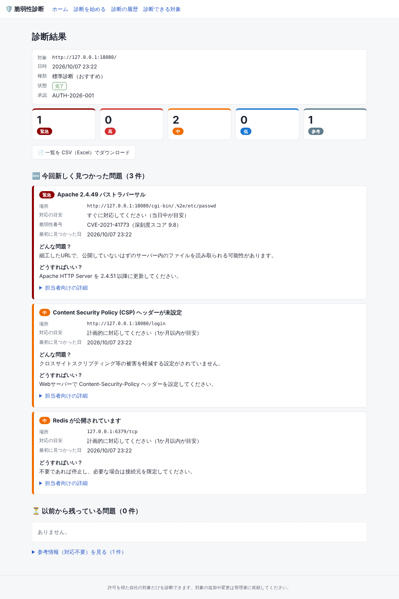

# vulnscan-automation

自社で管理・所有する資産に対して、OSS スキャナ（nmap / nuclei / OWASP ZAP）および
内蔵の Web アプリ診断（webcheck）による脆弱性診断を自動実行し、結果を集約・差分化して
レポートするツールです。

> **重要:** 本ツールは承認済みスコープ（`scope.yaml`）に含まれる対象以外には一切スキャンを
> 実行しません。第三者が所有・管理する資産を、所有者の書面による許可なく診断することは
> 不正アクセス禁止法等に抵触するおそれがあります。

## かんたんな使い方（画面で操作）

ブラウザだけで診断の実行と結果の確認ができます。操作方法は
**[使い方ガイド（画面で操作する方向け）](docs/user-guide.md)** を参照してください。



### 管理者向け: 画面の起動（Docker）

```bash
mkdir -p config data
cp scope.example.yaml config/scope.yaml      # 診断してよい対象と承認情報を記入
docker compose up -d --build
# → ブラウザで http://localhost:8000/ を開く
```

- 既定では起動した PC からしか開けません。ほかの PC からも使う場合は `.env` に
  `VULNSCAN_UI_HOST=0.0.0.0` と `VULNSCAN_UI_PASSWORD=（長いパスワード）` を書いて起動し直してください
  （パスワード未設定のまま外部に公開する設定は起動時に拒否されます）。ログイン名は既定で `admin` です。
- コンテナは診断ツールを起動するために Docker のソケットを使います（ホストの管理者権限に相当します）。
  診断専用のサーバーで動かしてください。
- 診断対象の追加・変更は画面からはできません。`config/scope.yaml` をレビューのうえ更新してください
  （更新は画面の再起動なしで反映されます）。
- 誤検知の登録は `config/suppressions.yaml`（`suppressions.example.yaml` を参照）。

Docker を使わない場合: `pip install -e ".[web]"` のあと `vulnscan web -s scope.yaml --docker`
（`--docker` を外すとローカルにインストールした nmap / nuclei を使います）。

## 特徴

- **スコープガード**: 承認 ID・承認者・期間・時間帯・許可プロファイル・除外対象を
  `scope.yaml` で管理。ドメインは名前解決後の IP も承認 CIDR 内か確認します。
  ツール実行の直前に毎回再判定し、キルスイッチで全診断を即停止できます。
- **プロファイル**: `passive` / `standard` / `active` の 3 段階で侵襲度を制御
  （nuclei の intrusive・dos・fuzz テンプレートは standard 以下で除外）。
- **内蔵 Web アプリ診断（webcheck）**: 外部ツール不要（標準ライブラリのみ）で、OWASP Top 10 相当の
  軽量チェックを行います。セキュリティヘッダ・Cookie 属性・平文通信・情報露出・ディレクトリ一覧・
  混在コンテンツ・CSRF トークン欠落（受動）に加え、standard 以上では同一スコープ内の安全な GET で
  機微ファイルの露出・入力の反射（反射型 XSS の起点）・SQL エラーの反射（SQLi の兆候）を確認します。
  **読み取り中心で破壊的なペイロードは送らず、叩く URL は必ず承認スコープ内に限ります。**
- **正規化と差分**: 各ツールの結果を共通形式に変換し、前回との差分（新規・継続・解消）を出します。
- **誤検知管理**: 理由と期限付きで抑制（`suppressions.yaml`）。
- **監査ログ**: 判定結果と実行コマンドを JSON Lines で記録。
- **出力**: Markdown / JSON レポート、Slack 通知（任意）。

## 必要なもの

- Python 3.11 以上
- スキャナ: ローカルの `nmap` / `nuclei`、または Docker（`--docker` 指定時）
- ZAP は常に Docker イメージ `ghcr.io/zaproxy/zaproxy`（バージョン固定）で実行します
- 内蔵の `webcheck` は Python 標準ライブラリのみで動くため、外部ツールのインストールは不要です

## セットアップ

```bash
python3 -m venv .venv && . .venv/bin/activate
pip install -e ".[dev]"      # Web 画面も含む開発用一式
cp scope.example.yaml scope.yaml          # 対象と承認情報を記入
cp suppressions.example.yaml suppressions.yaml   # 任意
vulnscan scope validate -s scope.yaml
```

## コマンドでの使い方（エンジニア向け）

```bash
# 対象が診断可能かだけを確認（スキャンしない）
vulnscan scope check -s scope.yaml -t https://app.example.com/ -p standard

# 実行コマンドの確認（スキャンしない）
vulnscan scan -s scope.yaml -t https://app.example.com/ -p standard --dry-run

# 診断を実行
vulnscan scan -s scope.yaml -t https://app.example.com/ -p standard --docker

# scope.yaml に記載の URL・ドメインをすべて診断
vulnscan scan -s scope.yaml --all -p passive --docker
```

主なオプション:

| オプション | 説明 |
|---|---|
| `--tools nmap,nuclei,webcheck,zap` | 実行するツール（既定はこの 4 つ。URL 以外の対象では webcheck / zap は自動でスキップ） |
| `--profile passive\|standard\|active` | 侵襲度（承認で許可されたもののみ） |
| `--docker` | nmap / nuclei を Docker イメージで実行 |
| `--fail-on high` | high 以上の新規指摘があれば終了コード 1（CI 向け） |
| `--notify-min high` | Slack 通知の重大度下限（環境変数 `VULNSCAN_SLACK_WEBHOOK` を設定） |
| `--db` / `--out` / `--audit-log` | 保存先 |

終了コード: `0` 正常 / `1` `--fail-on` に該当 / `2` スコープ外の対象あり / `3` 設定エラー

レポートは `reports/<日時>/report.md` と `report.json` に出力されます。

### スキャナのバージョン

Docker で動かすスキャナのイメージはバージョンを固定しています（nmap `7.98` / nuclei `v3.11.1` /
ZAP `2.16.1`）。`:latest` だと診断内容が予告なく変わって前回との差分が揺れるためです。
更新するときは環境変数で上書きし、差分に問題がないことを確かめてからコードの既定値を上げてください。

| 環境変数 | 例 |
|---|---|
| `VULNSCAN_IMAGE_NMAP` | `instrumentisto/nmap:7.99` |
| `VULNSCAN_IMAGE_NUCLEI` | `projectdiscovery/nuclei:v3.12.0` |
| `VULNSCAN_IMAGE_ZAP` | `ghcr.io/zaproxy/zaproxy:2.17.0` |

### 結果の送信（MeshConsole などへの署名付き webhook）

`VULNSCAN_WEBHOOK_URL` を設定すると、診断のたびに対象ごとの「未対応の指摘（新規・継続）」と
「解消した指摘」を JSON で送ります（抑制中の指摘は件数のみ。拒否された対象は理由のみ）。

| 環境変数 | 説明 |
|---|---|
| `VULNSCAN_WEBHOOK_URL` | 送信先（例: `https://mc.example.com/api/vulnscan/ingest`） |
| `VULNSCAN_WEBHOOK_SECRET` | 署名用の共有シークレット（16 文字以上、必須） |
| `VULNSCAN_SOURCE_IPS` | このホストの送信元 IP（カンマ区切り）。受け手が自動ブロックの対象外にするのに使う |

本文には `X-Vulnscan-Timestamp`（UNIX 秒）と
`X-Vulnscan-Signature: sha256=HMAC-SHA256(secret, "<timestamp>.<本文>")` を付けます。
送信に失敗しても診断は失敗扱いにせず、監査ログに `webhook_error` を残します。

### 管理画面（MeshConsole）からの診断の開始

`VULNSCAN_REMOTE_SCAN=true` を設定すると、MeshConsole の「脆弱性」タブから診断を開始し、進み具合を
確認できるようになります。結果はこれまでどおり webhook で MeshConsole に届きます。

- 認証は結果送信と同じ `VULNSCAN_WEBHOOK_SECRET` による HMAC 署名です（設定は 1 つで済みます）。
  署名の対象は `"<timestamp>.<nonce>.<METHOD>.<path>.<本文>"` で、webhook の署名とは形が違うため流用できません。
  時刻ずれは ±5 分まで、同じ nonce は 10 分間受け付けません。
- 開始できるのは **`scope.yaml` に明記された URL・ドメイン・単一ホストの CIDR（/32・/128）だけ**です。
  CIDR の範囲内の任意の IP を指定することはできません。承認期間・時間帯・プロファイル・キルスイッチの
  判定は画面からの開始と同じく毎回行います。
- MeshConsole から届くように、`VULNSCAN_UI_HOST=0.0.0.0` と `VULNSCAN_UI_PASSWORD` も設定します
  （MeshConsole の画面がこの 3 行を含む `.env` の内容を作ります）。ポート 8000 は MeshConsole
  からだけ届くよう、VPN 経由にするかファイアウォールで送信元を絞ってください。

| メソッド・パス | 内容 |
|---|---|
| `GET /api/status` | scope.yaml の読み込み可否・キルスイッチ・実行中の診断 |
| `GET /api/targets` | 選べる対象と、今実行できるプロファイル（できない場合は理由） |
| `POST /api/scans` | 診断の開始（`target` / `profile` / `tools` / `actor` / `confirm: true`）。実行中は 409 |
| `GET /api/scans/{id}` | 進み具合とログ |

## 定期実行（社内サーバ）

`deploy/` に systemd の service / timer の例があります。

```bash
sudo cp deploy/vulnscan.service deploy/vulnscan.timer /etc/systemd/system/
sudo systemctl enable --now vulnscan.timer
```

運用上の注意:

- 診断専用ホストで実行し、送信元 IP を監視チーム・WAF 管理者へ事前に共有してください
- `scope.yaml` は本リポジトリとは別の非公開リポジトリで管理し、変更はレビュー必須にしてください
- レポートには脆弱性の詳細が含まれます。保存先の権限を限定してください
- 緊急停止: `touch /var/run/vulnscan.stop`（`kill_switch_file` で指定したパス）
  または `VULNSCAN_KILL=1`

## 開発

```bash
pytest -q
ruff check . && ruff format --check .
```

設計の詳細は [docs/design.md](docs/design.md) を参照してください。
