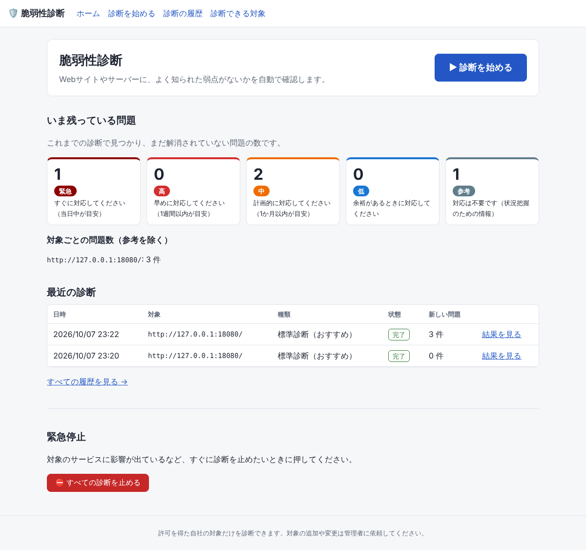
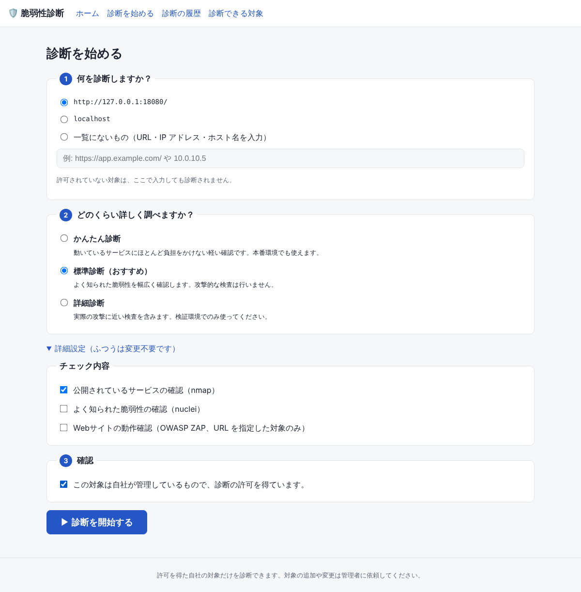
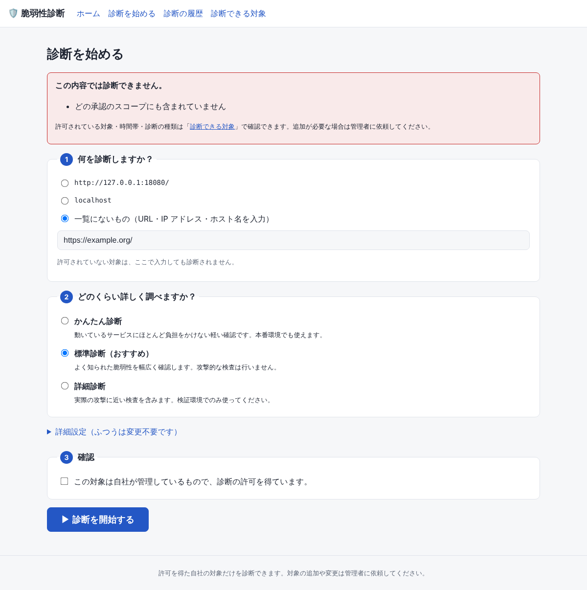
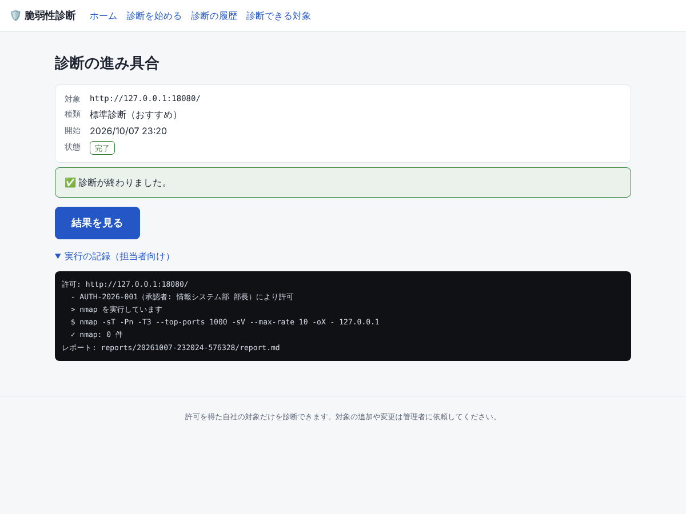
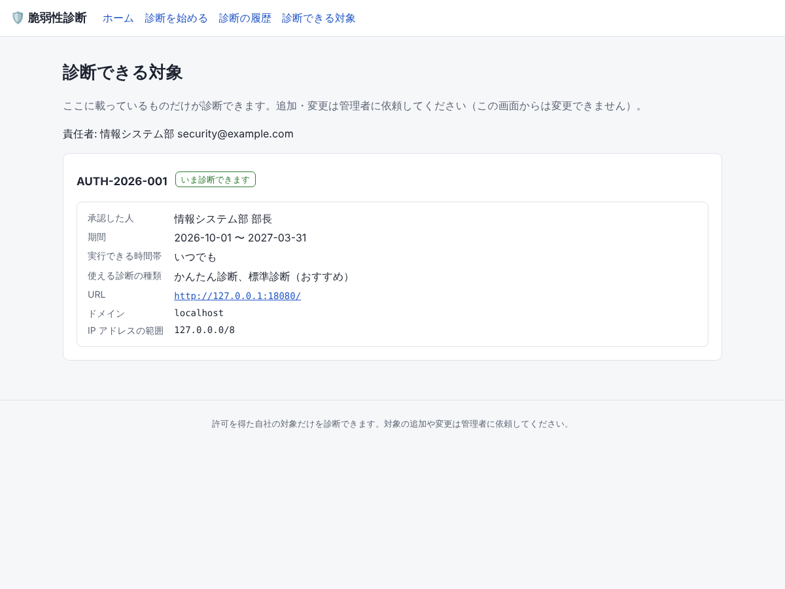

# 使い方ガイド（画面で操作する方向け）

このツールは、自社の Web サイトやサーバーに「よく知られた弱点（脆弱性）」がないかを自動で確認します。
操作はすべてブラウザで行います。コマンドを打つ必要はありません。

> 画面のアドレス（例: `http://localhost:8000/`）とログイン情報は管理者から受け取ってください。

## 1. ホーム画面

- **いま残っている問題**: これまでの診断で見つかり、まだ解消されていない問題の数です。
  色ごとに対応の目安が書いてあります。
- **最近の診断**: 直近の診断と、その結果へのリンクです。
- **緊急停止**: 対象のサービスが重くなったなど、すぐに止めたいときに押します。

## 2. 診断を始める

画面上の「▶ 診断を始める」を押します。

1. **何を診断しますか？** 一覧から選びます。一覧にないものは入力もできますが、
   許可されていない対象は診断されません。
2. **どのくらい詳しく調べますか？** 迷ったら「標準診断（おすすめ）」を選びます。
   本番環境で少しでも心配なときは「かんたん診断」を選んでください。
3. **確認** にチェックを入れて「▶ 診断を開始する」を押します。

「詳細設定」は通常変更する必要はありません。

### 診断できないと表示されたとき

赤い枠に理由が表示されます。よくある理由:

| 表示 | 意味 | どうすればいい？ |
|---|---|---|
| 許可リストに登録されていない対象です | その URL や IP は診断の許可を得ていません | 管理者に追加を依頼してください |
| 実行可能な時間帯の外です | 診断してよい時間帯が決まっています | 「診断できる対象」画面で時間帯を確認してください |
| 診断の種類 ○○ はこの対象では許可されていません | 選んだ詳しさが許可されていません | 「かんたん診断」か「標準診断」を選び直してください |
| 承認期間外です | 許可の有効期限が切れています | 管理者に更新を依頼してください |
| 緊急停止（キルスイッチ）が有効 | 緊急停止中です | ホーム画面の「緊急停止を解除する」を押すか、管理者に確認してください |

## 3. 進み具合を見る

開始すると進み具合の画面に切り替わります。数分〜数十分かかることがあります。
画面は自動で更新されます。**画面を閉じても診断は続きます。**

終わったら「結果を見る」を押します。

## 4. 結果を見る

- 上の色つきの数字が、重大度ごとの問題の数です。
- **今回新しく見つかった問題**: 前回の診断にはなかった問題です。まずここを確認してください。
- **以前から残っている問題**: 前回も見つかっていて、まだ直っていない問題です。
- **解消された問題**: 前回はあって、今回はなくなった問題です。
- **参考情報**: 対応は不要です。

それぞれの問題には「どんな問題？」「どうすればいい？」が書いてあります。
説明が英語の場合や、専門的な内容は「担当者向けの詳細」を開発・インフラの担当者に共有してください。

「一覧を CSV（Excel）でダウンロード」で、問題の一覧を Excel で開けるファイルとして保存できます。
担当者への依頼や報告に使ってください。

### 重大度と対応の目安

| 表示 | 対応の目安 |
|---|---|
| 緊急 | すぐに対応（当日中が目安） |
| 高 | 早めに対応（1週間以内が目安） |
| 中 | 計画的に対応（1か月以内が目安） |
| 低 | 余裕があるときに対応 |
| 参考 | 対応不要 |

## 5. 診断できる対象を確認する

上のメニューの「診断できる対象」で、許可されている対象・期間・時間帯・診断の種類を確認できます。
対象の名前（URL）を押すと、その対象で診断を始められます。この画面から対象を追加・変更することはできません。
